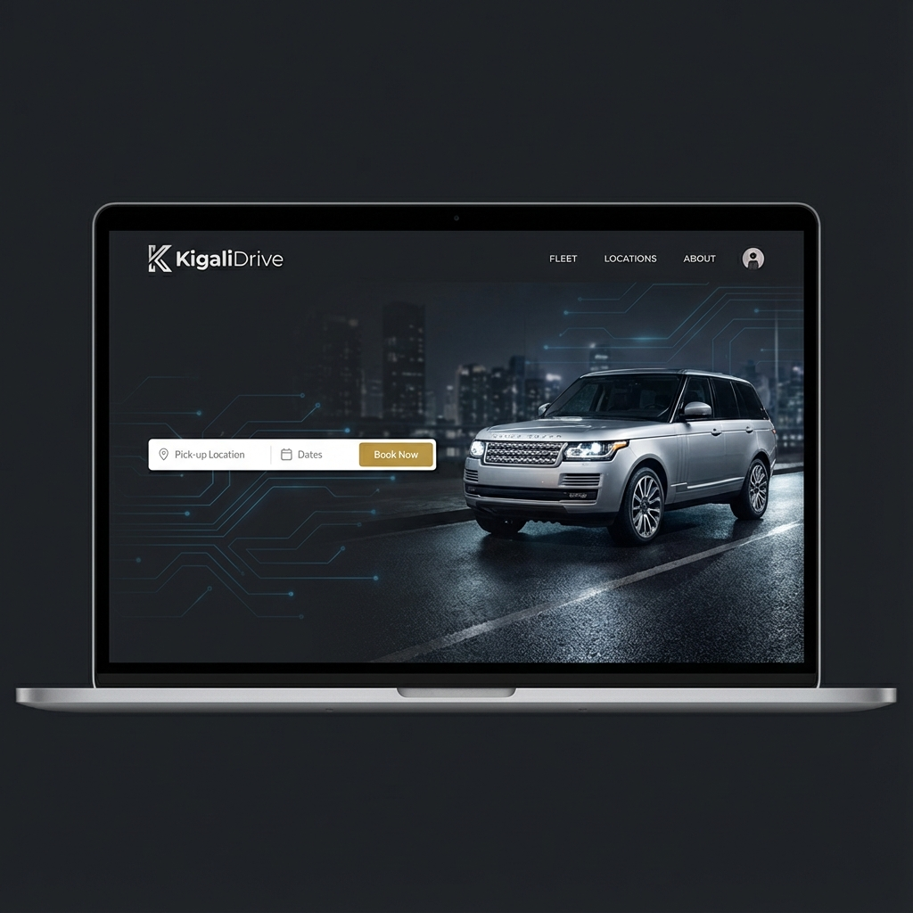

# KigaliDrive Presentation

An interactive, high-performance slide presentation platform built for **KigaliDrive**, Rwanda's premier car rental management system. This project showcases the technical architecture, business logic, and future roadmap of the platform using a modern web-based approach.



## 🚀 Key Features

*   **Interactive Slides**: Fluid animations and transitions between slides.
*   **Full Screen Mode**: Immersive presentation experience with a robust toggle.
*   **Responsive Design**: Adapts perfectly to different screen sizes with smart scrolling for overflow content.
*   **Realistic Visuals**: High-quality mockups and glassmorphism UI design.
*   **Keyboard Navigation**: seamless navigation using Arrow keys.
*   **Slide Counter**: Easy tracking of presentation progress.

## 🛠️ Technology Stack

*   **Framework**: [Next.js 16](https://nextjs.org/) (React 18)
*   **Styling**: Custom CSS & [Lucide React](https://lucide.dev/) Icons
*   **Deployment**: Static Export (Ready for Vercel/Netlify)

## 📦 Installation

1.  **Clone the repository**:
    ```bash
    git clone https://github.com/yourusername/kigalidrive-presentation.git
    cd kigalidrive-presentation
    ```

2.  **Install dependencies**:
    ```bash
    npm install
    ```

3.  **Run locally**:
    ```bash
    npm run dev
    ```
    Open [http://localhost:3000](http://localhost:3000) to view it in the browser.

## 🚀 Deployment

This project is configured for **Static Export**, making it easy to deploy on any static hosting service.

### Deploy to Vercel (Recommended)
1.  Push your code to GitHub.
2.  Import the project into Vercel.
3.  Vercel will detect Next.js. Click **Deploy**.

### Manual Build
To generate the static files locally:
```bash
npm run build
```
The output will be in the `out/` directory.

## 📄 License

This project is licensed under the MIT License - see the [LICENSE.md](LICENSE.md) file for details.

---
*Built with ❤️ for KigaliDrive*
